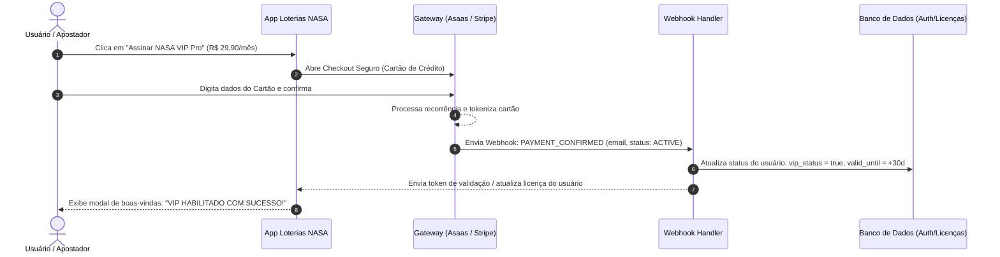

# 💳 Arquitetura de Cobrança Recorrente (Cartão de Crédito e Pix Automático)

Este documento especifica a esteira de pagamentos em modelo SaaS com **cobrança recorrente automática no cartão de crédito** para o **Loterias NASA Pro**.

---

## 1. Grade de Planos & Preços (Pricing Strategy)

| Nível / Plano | Valor | Ciclo de Cobrança | Recursos Inclusos |
| :--- | :--- | :--- | :--- |
| **Pioneiro (Free Trial)** | R$ 0,00 | Degustação Vitalícia / 3 dias PRO | 1 jogo por clique, 1 auditoria diária, visualização básica de calor. |
| **Comandante NASA VIP (Mensal)** | **R$ 29,90** / mês | Recorrência mensal automática no cartão | Geração em lote (até 5 jogos simultâneos), Bateria dos 6 Testes completa, IA de substituição em tempo real, download TXT ilimitado. |
| **Comandante NASA VIP (Anual)** | **R$ 197,00** / ano | Recorrência anual (equivale a R$ 16,40/mês) | Todos os benefícios do mensal + 45% de economia + Acesso prioritário a novas loterias. |
| **Bolão Corporativo / Syndicate** | **R$ 59,90** / mês | Recorrência mensal no cartão | Rateador de cotas com envio individual de cobrança Pix no WhatsApp + Relatório PDF personalizado do bolão. |

---

## 2. Gateways Recomendados para o Mercado Brasileiro

Para cobrança recorrente no Brasil com cartão de crédito, destacam-se duas opções líderes:

1. **Asaas (Altamente Recomendado para Brasil):**
   - Suporte nativo e robusto a **assinaturas recorrentes em cartão de crédito** e **Pix Cobrança automática**.
   - Notificações de cobrança, régua de cobrança automática por e-mail/SMS/WhatsApp se o cartão vencer ou não passar.
   - Taxas competitivas (~ 1,99% a 2,99% por transação).
   - Checkout transparente (o cliente não sai do app) ou link de pagamento seguro.

2. **Mercado Pago / Stripe Billing:**
   - O Stripe possui o melhor checkout do mundo para cartão internacional e nacional.
   - O Mercado Pago possui altíssima penetração com Pix e saldo em conta no Brasil.

---

## 3. Fluxo de Ativação Instantânea via Webhook

O fluxo de autorização funciona através de uma arquitetura simples e segura (Serverless / Firebase / Supabase ou Cloudflare Workers):



---

## 4. Liberação Local no Front-end (Payload da Licença)

No código do front-end (`index.html`), o status de liberação é gerenciado pelo objeto de telemetria `userLicense`:

```javascript
// Exemplo de verificação de licença recebida da API de Assinatura:
const userSession = {
  email: "apostador@email.com",
  plan: "NASA_VIP_MONTHLY",
  status: "ACTIVE", // ACTIVE, TRIAL, EXPIRED
  features: {
    batchGeneration: true,      // Libera 2, 3 e 5 jogos simultâneos
    advanced6Tests: true,       // Libera detalhamento dos 6 testes
    unlimitedTelemetry: true,   // Libera sem paywall
    syndicateShare: true        // Libera gerador de bolão para WhatsApp
  }
};
```

---

## 5. Próximos Passos de Implementação Prática

1. **Criar conta PJ ou PF no Asaas ou Stripe.**
2. **Cadastrar o produto "Loterias NASA VIP"** com preço recorrente de R$ 29,90/mês e R$ 197,00/ano.
3. **Plugar a URL do Checkout** diretamente no botão `"QUERO SER NASA VIP PRO"` do modal de assinatura existente no `index.html`.
