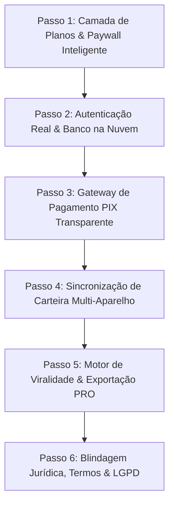

# Plano de Transformação: Loterias NASA Pro em SaaS Comercial

Este plano detalha a conversão do **Loterias Analytics Pro (NASA Telemetry Edition)** de uma ferramenta estática de página única em uma **plataforma SaaS comercial completa (Software as a Service)** com planos Free/PRO, paywall inteligente, autenticação na nuvem, cobrança via PIX/Cartão e conformidade jurídica.

---

## Estrutura do Plano (Passo a Passo)

---

## Passo 1: Camada de Planos & Paywall Inteligente (Free vs. PRO)

### O que faremos:
Definir claramente o que o usuário **Gratuito** pode fazer e onde ele encontra a **trava de conversão PRO**.

* **No Plano Grátis (Visitante / Free):**
  * Pode gerar até **1 jogo** de cada vez no volante.
  * Acesso ao **Mapa de Calor básico** e **Radar do Ciclo**.
  * Acesso a **2 testes estatísticos** (Sequências e Paridade).
  * Salvar até **2 bilhetes** na Carteira local.
* **No Plano NASA VIP / PRO:**
  * Geração em lote ilimitada (**3, 5, 10 ou mais apostas** simultâneas).
  * **Matriz 4x4 completa** com escolha de quadrante excluído.
  * **Bateria completa dos 6 Testes Orbitais** com diagnósticos de IA e substituição instantânea.
  * **Simulador Histórico Retrospectivo** nos 50 últimos concursos.
  * **Gestão de Bolão Profissional** com cálculo de cotas e divisão automática.
  * Exportação direta para WhatsApp sem limites e para o carrinho da Caixa Lotérica.
  * Carteira de bilhetes ilimitada na nuvem.

### Elementos Visuais:
* Modal de Upgrade VIP com design futurista HUD: *"Desbloqueie a Telemetria Orbital Completa da NASA"*.
* Selo **PRO** nos botões bloqueados com efeito neon pulsante.
* Degradação elegante: o usuário pode experimentar 1 aposta grátis para se encantar com o sistema antes de assinar.

---

## Passo 2: Autenticação Profissional & Banco de Dados na Nuvem

### O que faremos:
Substituir a tela de login estática com senha fixa (`vitorio / 96723842`) por um sistema de autenticação real.

* **Stack:** **Supabase** (PostgreSQL na Nuvem + Auth JWT + Row Level Security).
* **Opções de Entrada:**
  * Login com **1 clique via Google**.
  * Cadastro com **E-mail e Senha** (com recuperação de senha via link seguro).
  * Modo *"Testar Gratuitamente"* sem cadastro inicial (para diminuir o atrito de entrada).
* **Estrutura de Tabelas:**
  * `profiles`: `id`, `email`, `nome`, `plano` ('free' | 'pro'), `data_expiracao_pro`, `created_at`.
  * `bilhetes`: `id`, `user_id`, `modalidade`, `dezenas`, `data_jogo`, `custo`, `status`.

---

## Passo 3: Gateway de Pagamento & Checkout PIX Automatizado

### O que faremos:
Integrar checkout transparente focado em **PIX com aprovação em tempo real (menos de 5 segundos)** e cartão de crédito.

* **Provedor Recomendado:** **Asaas** ou **Mercado Pago** (taxas de PIX mais baixas do mercado nacional e integração via Webhooks simples).
* **Fluxo de Conversão:**
  1. O usuário clica em *"Assinar Plano VIP"* dentro do app.
  2. Abre o modal de checkout com opções:
     * **Mensal:** R$ 29,90 / mês.
     * **Anual (Recomendado):** R$ 147,00 / ano (com 58% de desconto).
  3. O app gera o **QR Code do PIX e o código "PIX Copia e Cola"** na tela.
  4. O usuário paga no app do banco dele.
  5. O webhook confirma o pagamento instantaneamente e a tela do usuário comemora com efeito sonoro e confetes: *"Conta promovida para NASA VIP!"*.

---

## Passo 4: Sincronização em Nuvem da Carteira de Bilhetes

### O que faremos:
* Permitir que o apostador monte seus jogos no computador de casa e, ao chegar na lotérica com o celular, abra o app e encontre exatamente os mesmos bilhetes salvos na carteira.
* Histórico de conferência em nuvem com alertas de prêmios.

---

## Passo 5: Mecanismos de Crescimento Viral (Growth Loops)

### O que faremos:
* **Assinatura Viral em Relatórios:** Ao exportar bolões para o WhatsApp, incluir no rodapé:
  `🚀 Palpites gerados e auditados pela Inteligência Loterias NASA Pro. Teste grátis em: loteriasnasa.pro`
* **Programa de Afiliados / Convide um Amigo:** O usuário PRO ganha 1 mês grátis para cada amigo que assinar pelo link dele.
* **Modo Impressão em Folha A4 / PDF:** Exportação de volantes prontos para conferência em reuniões de bolão da firma ou família.

---

## Passo 6: Blindagem Jurídica, Termos de Uso e LGPD

### O que faremos:
* Adicionar página e modal de **Termos de Uso & Jogo Responsável**.
* Política de Privacidade em total conformidade com a **LGPD (Lei Geral de Proteção de Dados)**.
* **Disclaimer Obrigatório:** Cláusula de proteção legal deixando explícito que o software é uma ferramenta matemática de auxílio e análise probabilística, sem garantia de premiação, cumprindo as exigências do Código de Defesa do Consumidor e do CONAR.

---

## Perguntas para Alinhamento com o Usuário

> [!IMPORTANT]
> **Definição de Provedor de Pagamento:**  
> Você já possui conta jurídica (PJ/MEI) ou física em algum gateway de pagamentos como **Mercado Pago**, **Asaas** ou **Stripe**, ou prefere que iniciemos com o fluxo simulado/arquitetado enquanto você define a conta bancária?

> [!TIP]
> **Estratégia de Implementação:**  
> Vamos executar o **Passo 1 (Camada de Planos Free vs. PRO + Paywall + Modal de Assinatura)** de imediato no código para você ver o sistema funcionando comercialmente com as travas e visual de venda.

---

## Plano de Verificação

### Testes Automatizados e de Interface:
1. Testar o bloqueio de recursos PRO quando o status for `free` (ex: limite de 1 jogo, travamento dos 6 testes extras e da matriz 4x4).
2. Testar o modal de checkout PIX e o desbloqueio ao alternar a flag para `pro`.
3. Validar a responsividade do modal de vendas no celular e desktop.
4. Garantir que nenhuma funcionalidade existente foi danificada.
